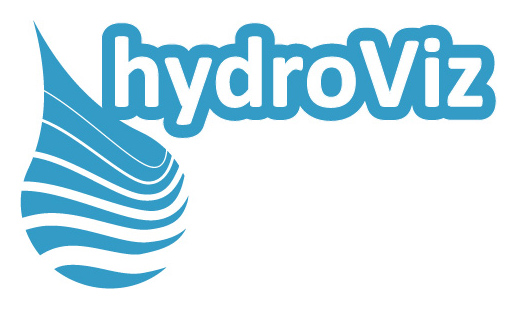
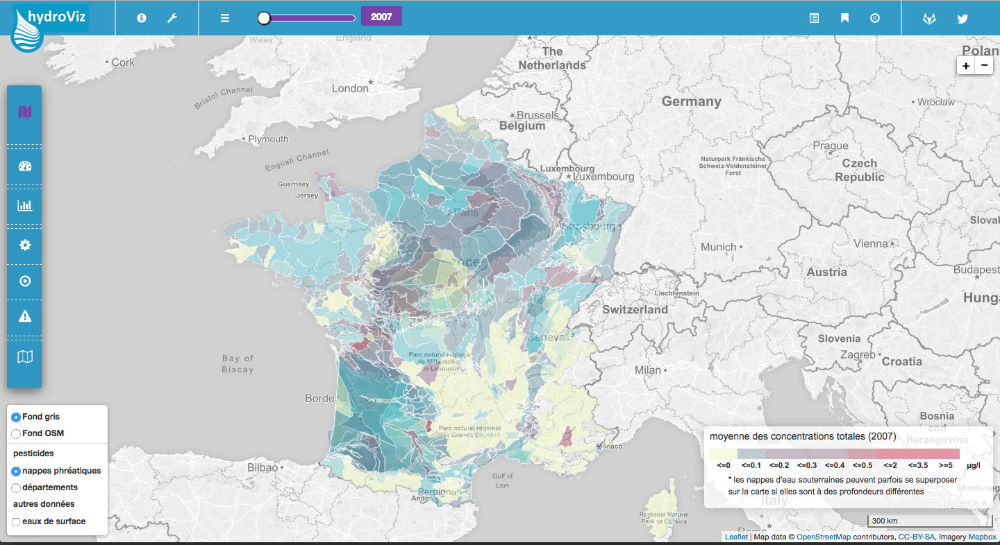

[](https://www.hydroviz.fr)


## **HydroViz** is a web application based on [Flask](http://flask.pocoo.org/) Python microframework providing a full-featured data vizualisation of groundwater pollutants in France between 2007 and 2014.
## **HydroViz** is available online : **[hydroviz.fr](https://www.hydroviz.fr)**.

---

#### **HydroViz** has been created in response to a [contest](http://www.developpement-durable.gouv.fr/Concours-de-data-visualisation-sur.html) proposed by the [French ministry of ecology, energy and sea](http://www.developpement-durable.gouv.fr/).

---




----------------------------------------------------
## Licence & copyrights :

- **Licence** : [GNU GPL](https://gitlab.com/Julien_P/concours_pesticides/blob/master/LICENSE)

- **Author** : Copyright (C) 2017 [Julien Paris](http://jpylab.com/)

- **Contact** : hydroviz.fr@gmail.com


>
Copyright (C) 2017  Julien PARIS
>
This program is free software: you can redistribute it and/or modify
it under the terms of the GNU General Public License as published by
the Free Software Foundation, either version 3 of the License, or
(at your option) any later version.
>
This program is distributed in the hope that it will be useful,
but WITHOUT ANY WARRANTY; without even the implied warranty of
MERCHANTABILITY or FITNESS FOR A PARTICULAR PURPOSE.  See the
GNU General Public License for more details.
>
You should have received a copy of the GNU General Public License
along with this program.  If not, see <http://www.gnu.org/licenses/>.
>
Also add information on how to contact you by electronic and paper mail.


-----------------------------------------------------
## Features :

This app proposes different features :

- **_time slider_** to dynamically change years
- **_interactive cartography_** of groundwaters in France
- **_treemap of pollutants_** for every groundwater layer

-----------------------------------------------------
## Installation documentation :

### Application requirements :

- Python 2.7
- Python libraries : Pandas, geoPandas, flask-socketio, eventlet
- NGINX
- Gunicorn
- Jupyter (optionnal)
- server side : ubuntu 14.04 x64 | 4 Go RAM minimum


### Installation :

- update ubuntu : `$ sudo apt-get update`


- install GIT on the server : `$ sudo apt-get install git`


- clone hydroviz project :
>
```
$ mkdir apps
$ cd app_colors
$ git config --list
$ git init
$ git clone git@gitlab.com:Julien_P/concours_pesticides.git
```


- configure firewall for socketIO, NGINX and Gunicorn :
>
```
$ sudo ufw allow www
$ sudo ufw allow 8000
$ sudo ufw allow 3000
$ sudo ufw allow 5000
$ sudo ufw enable (+ Y)
```


- install NGINX on the server :
>
```
$ sudo apt-get install nginx
$ service nginx restart
```


- install Python, PIP, and dependencies :
>
```
$ sudo apt-get install python-pip python-dev (+ Y)
$ pip install -r requirements.txt
$ pip install gunicorn
$ pip install eventlet
```


- configure NGINX : `$ cd ~/etc/nginx/sites-enabled`
>
copy file `hydroviz` (from `./nginx_config/sites-enabled`) there


- run application :
>
go to same level than `wsgi.py` and start app by :
```
$ gunicorn --bind 0.0.0.0:5000 —-timeout=120 --workers=1 —-worker-class eventlet wsgi:app &
```


- ( if needed / stop unicorn server ) : `$ pkill gunicorn`


### Import new dataset :

- add the new dataset as .xls file in `./statics/data/stats`
- run `pesticides_analysis_03.ipynb` in jupyter
	+ within `pesticides_analysis_03.ipynb` change var `copies_done` to `False`
